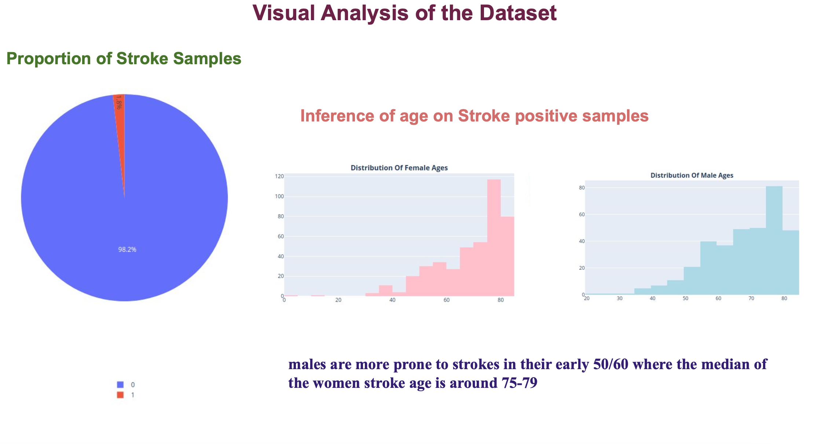

# Stroke_Prediction
Stroke Probability Prediction from Clinical Measurements of Patients using PySpark

## Stroke Probability Prediction from Clinical Measurements of Patients using PySpark

### Project Overview
This project aims to predict the probability of stroke in patients using clinical measurements. Leveraging the power of PySpark, we built a machine learning model to classify patients based on various clinical factors such as hypertension, heart disease, age, work type, smoking status, and family history of disease.



### Objective
- **Predict stroke probability** and classify patients based on clinical measurements.
- Use **SQL queries** to return results as dataframes.
- Utilize **PySpark ML models** to predict the risk score of stroke and classify patient IDs.
- Employ different **visualization methods** to analyze the dataset and identify key risk factors.

### Motivation
According to the World Health Organization (WHO), ischaemic heart disease and stroke are among the world's biggest killers. This project seeks to analyze which factors contribute most to stroke outcomes and build predictive models to help identify at-risk individuals.

### Why PySpark?
- Apache Spark is an open-source framework that is concise and easy to use.
- It enables data processing in a distributed fashion, making applications up to 100x faster than traditional systems.
- PySpark includes native machine learning and graph libraries, which are highly useful for prediction tasks on large datasets.

### Dataset
- **Training Dataset:** Contains information about 43,400 patients, 726 of whom had a stroke.
- **Test Dataset:** Contains data on 18,601 patients.

### Data Exploration
- The training dataset includes 726 stroke cases out of 43400 patients.
- Analyzed the relationship between 'work type' and stroke probability, finding that people in 'private jobs' are more prone to strokes.
- Gender distribution showed 60% females and 40% males, with stroke incidence varying with age and gender.

### Data Cleaning and Feature Engineering
- Filled missing values in 'smoking status' with 'No info' and in 'bmi' with the mean value.
- Encoded categorical data using `StringIndexer` and one-hot encoding.
- Used `VectorAssembler` to merge feature columns into a vector.

### Model Building
- Created a `DecisionTreeClassifier` and constructed a pipeline for data processing and model fitting.
- Split the dataset into training and validation sets, achieving an accuracy of 98.23% on the validation set.

### Results
- Applied the model to predict labels and probabilities for the test dataset.
- Identified age, BMI, and glucose level as significant predictors of stroke risk.

### Discussion
- The `DecisionTreeClassifier` demonstrated high accuracy.
- Analysis revealed gender differences in stroke age: males are prone to strokes in their 50s and 60s, while females are more likely in their 70s.
- The project highlights the potential of machine learning in healthcare for early detection and intervention.

### Visual Analysis
- Visualizations showed the distribution of stroke samples, age influence on stroke incidence, and the impact of work type, residency, and marital status on stroke probability.

### Repository Structure
- **data/**: Contains the training and test datasets.
- **notebooks/**: Jupyter notebooks with data exploration, cleaning, feature engineering, and model building.
- **scripts/**: Python scripts for data processing and model training.
- **results/**: Model predictions and performance metrics.
- **visualizations/**: Plots and charts illustrating the data analysis and results.

### Installation
1. Clone the repository:
   ```bash
   git clone https://github.com/shreyasic77/Stroke_Prediction.git
